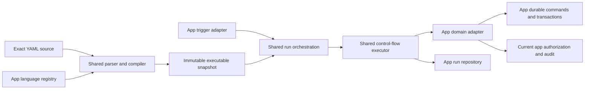

# Shared workflow kernel design

The shared workflow kernel should preserve the mature Grids workflow language and runtime behavior while letting Mail add domain-specific triggers, values, conditions, and actions through narrow registries.

Status: Draft for Grids review. Last updated: 2026-07-14. This document is a proposed cross-app contract, not an implementation commitment. Grids is the compatibility authority; Mail adapts to Grids unless an additive change clearly benefits both applications.

## Contents

- [Decision summary](#decision-summary)
- [Goals and non-goals](#goals-and-non-goals)
- [Current baseline](#current-baseline)
- [Canonical workflow language](#canonical-workflow-language)
- [Kernel and adapter boundary](#kernel-and-adapter-boundary)
- [Reusable workflow building blocks](#reusable-workflow-building-blocks)
- [Mail adapter requirements](#mail-adapter-requirements)
- [Persistence and lifecycle](#persistence-and-lifecycle)
- [Execution safety and horizontal scaling](#execution-safety-and-horizontal-scaling)
- [Editor and developer experience](#editor-and-developer-experience)
- [Extraction plan](#extraction-plan)
- [Verification gates](#verification-gates)
- [Questions for the Grids review](#questions-for-the-grids-review)

## Decision summary

1. **Grids defines the language.** Existing Grids YAML remains valid and keeps its current meaning. The canonical top-level structure stays `inputs`, `triggers`, and `steps`.
2. **One grammar, app-specific vocabulary.** Grids and Mail share parsing, expressions, control flow, diagnostics, execution semantics, and editor contracts. Each app registers its own resource types, triggers, conditions, and actions.
3. **Mail's provisional JSON workflow DSL is not a second public language.** New Mail workflows use the Grids-shaped YAML language. Existing Mail definitions and runs remain immutable audit records while active definitions are migrated before the unified editor becomes public.
4. **The kernel is small.** It owns language mechanics and reliable orchestration. It does not own app permissions, domain queries, provider commands, audit policy, or app database tables.
5. **Persistence remains app-owned.** Grids keeps its workflow and run tables. Mail keeps immutable versions, target runs, command journal integration, and mailbox-scoped indexes. The kernel consumes repository ports instead of introducing generic workflow tables.
6. **Existing primitives are reused before new syntax is added.** `if` is the common "only run when" construct. `triggers.schedule` starts scheduled workflows. A shared temporal condition may be added for work-hour checks. A generic delayed-action primitive is deferred until a second app needs the same durable behavior.
7. **Side-effect hardening is an extraction gate.** The open Grids work for retry-safe external effects must be settled before shared execution is presented as generally safe. Extraction must preserve today's fail-safe behavior and must not make retries more aggressive.

## Goals and non-goals

### Goals

- Give users one recognizable YAML workflow language across Cloud apps.
- Preserve Grids behavior and source compatibility during extraction.
- Reuse the difficult parts once: strict YAML parsing, diagnostics, expressions, control flow, run claims, leases, fencing, recovery, step restoration, schedules, and editor intelligence.
- Let apps expose strongly typed domain capabilities without coupling the kernel to Grids records or Mail messages.
- Support hundreds of mailboxes and workflows without process-local authority, global workflow scans, or one queue payload per message body.
- Make deterministic rules the baseline and leave a clean extension point for later AI decisions.
- Keep app permissions and current-resource access authoritative at execution time.

### Non-goals

- A cross-app workflow that moves data between arbitrary Cloud apps.
- A universal low-code platform or visual workflow builder.
- One shared workflow database schema.
- Forcing Grids and Mail to use the same authoring/version lifecycle.
- Making every app action available in every other app.
- Introducing delayed actions, approvals, calendars, or AI nodes before a concrete workflow requires them.
- Rewriting stable Grids domain logic merely to make it look generic.

## Current baseline

### Grids is the compatibility baseline

The current Grids implementation already contains most of the reusable mechanics:

- `packages/grids/src/contracts.ts` defines a strict YAML-compatible contract with `inputs`, one or more `triggers`, and recursive `steps`.
- Built-in triggers are `form`, `api`, `scanner`, `bulkSelection`, `dashboardButton`, `schedule`, and `recordEvent`.
- Built-in control flow is `if`/`then`/`else`, `switch`, and `forEach`; common terminal and state actions include `setVariable`, `succeed`, and `fail`.
- `packages/grids/src/workflows/dsl.ts` parses YAML with duplicate-key protection, bounded aliases, line/column diagnostics, Zod validation, and semantic validation.
- `packages/grids/src/workflows/value-expression.ts` defines exact `${{ reference }}` and `${{ now() }}` expressions.
- `packages/grids/src/service/workflow-runtime-executor.ts` already separates the recursive executor from most Grids domain behavior. It handles step paths, scopes, restoration, loop limits, heartbeats, and interruption detection through injected hooks.
- `packages/grids/src/service/workflow-runtime.ts` supplies Grids-specific values, references, authorization, actions, catalog snapshots, audit, and run orchestration.
- `packages/grids/src/service/workflow-trigger-runtime.ts` and `workflow-trigger-schedules.ts` provide durable jobs, recovery, deterministic trigger keys, stable scheduler IDs, and stale-registration repair using `@valentinkolb/sync`.
- `packages/grids/src/frontend/_components/workflows/WorkflowEditor.tsx` provides the current YAML editor, diagnostics, completions, reference help, and optimistic revision handling.

This is a strong starting point, but it is not yet a finished generic runtime. In particular, the open Grids work for durable retry-safe external effects must resolve the crash window between performing an effect and persisting its result. The shared design must expose this limitation rather than hiding it behind a generic interface.

### Mail has a strong domain runtime but a provisional language

Mail currently has an immutable workflow/version model, preview and effect budgets, per-message target runs, durable command integration, and a bounded evaluator. Its provisional definition in `packages/mail/src/contracts.ts` differs from Grids in several ways:

- metadata and priority are embedded in the definition;
- there is one `manual` or `backfill` trigger;
- conditions use a Mail-specific `field`/`operator` form with `all`, `any`, and `not`;
- actions use discriminated `action` strings;
- steps use `when`/`then`/`else` rather than Grids `if`/`then`/`else`.

Those differences should not become a second user-facing workflow dialect. Mail should retain its domain safety, preview, target batching, and immutable versions while compiling new authoring source through the Grids-shaped language.

## Canonical workflow language

### Compatibility rules

The following rules are hard constraints for the first extraction:

- Every currently valid Grids workflow remains valid without source edits.
- Existing action, trigger, condition, and expression names keep their current behavior.
- Unknown keys remain validation errors. Extensibility comes from an app's explicit registry, not permissive schemas.
- `name`, `description`, ordering, activation state, and revision/version metadata remain outside YAML.
- Compilation is deterministic for a given source, language registry version, and domain catalog snapshot.
- Runtime additions are additive. Mail requirements do not rename or reinterpret Grids syntax.

### Common grammar

The canonical grammar remains:

```yaml
inputs:
  item:
    type: text
    required: true

triggers:
  api:
    enabled: true

steps:
  - if:
      exists: inputs.item
    then:
      - setVariable:
          name: result
          value: ${{ inputs.item }}
      - succeed:
          message: Processed ${{ result }}
```

The kernel owns the shape and behavior of `inputs`, `triggers`, `steps`, expressions, scopes, and common control flow. Registries contribute the strict schemas and runtime behavior available inside those slots.

### Registry composition

"One language" does not mean one global union containing every Cloud action. A workflow is compiled for exactly one app adapter. Grids can expose record and document actions while Mail exposes message and collaboration actions, but both use the same grammar and editor protocol.

Conceptually, an app defines its language as follows:

```ts
const mailWorkflowLanguage = defineWorkflowLanguage({
  id: "mail",
  inputs: {
    ...commonInputs,
    mailMessage: mailMessageInput,
    mailConversation: mailConversationInput,
  },
  triggers: {
    ...commonTriggers,
    messageReceived: mailMessageReceivedTrigger,
  },
  conditions: {
    ...gridsCompatibleConditions,
    contains: containsCondition,
    all: allCondition,
    any: anyCondition,
    not: notCondition,
    inTimeWindow: inTimeWindowCondition,
  },
  actions: {
    ...commonActions,
    addKeyword: mailAddKeywordAction,
    moveMessage: mailMoveMessageAction,
    assignConversation: mailAssignConversationAction,
  },
});
```

This is an API direction, not a frozen TypeScript signature. The Grids review should validate the smallest registry shape that can be extracted from the existing code without duplicating schema, validator, runtime, and editor metadata.

### Proposed Mail source

Mail authoring should look like Grids, with Mail-specific vocabulary only where the domain requires it:

```yaml
inputs:
  message:
    type: mailMessage
    required: true

triggers:
  messageReceived:
    input: message

steps:
  - if:
      all:
        - contains:
            - ${{ inputs.message.subject }}
            - invoice
        - not:
            contains:
              - ${{ inputs.message.sender.email }}
              - example.invalid
    then:
      - addKeyword:
          message: inputs.message
          keyword: Finance
      - moveMessage:
          message: inputs.message
          folder: Invoices
```

The `all`, `not`, `contains`, `mailMessage`, and Mail action names above are proposed additive vocabulary. Their exact names and value typing require Grids review. The surrounding structure is the compatibility decision.

Human-readable catalog references in source must compile to stable app-owned identities or be frozen in the run snapshot. A folder or table display name must never be the runtime authority after it is renamed or becomes ambiguous.

### Direct invocation and backfill

Manual execution and backfill should not create another step language:

- Direct UI, API, CLI, or agent execution uses the existing direct-invocation concept represented by Grids `api` or a thin shared invocation port.
- A Mail backfill is an execution mode that resolves a bounded target query and invokes the same compiled workflow for each target.
- Mail keeps target-level progress, effect budgets, preview hashes, cancellation, and resumability outside the YAML grammar.
- Live delivery and backfill therefore execute the same steps against the same frozen input shape.

## Kernel and adapter boundary



### The kernel owns

- strict YAML parsing, exact-source hashing, and source diagnostics;
- registry composition into a strict definition schema;
- structural and registry-provided semantic validation;
- expressions, scopes, variables, and output restoration;
- `if`, `switch`, `forEach`, `setVariable`, `succeed`, and `fail`;
- deterministic step paths, loop bounds, and execution limits;
- run claim, lease, heartbeat, fencing, cancellation, and recovery protocols through a repository port;
- step lifecycle and the rules for restoring completed work after restart;
- trigger idempotency keys and generic schedule registration through scheduler ports;
- common execution events and diagnostics;
- a registry-driven completion/reference model for YAML editors.

### An app adapter owns

- resource permissions and current-access rechecks;
- the app's workflow metadata and activation policy;
- domain input resolution and immutable resource/catalog snapshots;
- trigger event ingestion and app-specific trigger filtering;
- domain references and value projection;
- action planning and execution;
- durable command creation, reconciliation, and provider interaction;
- audit details, actor representation, and sensitive-value redaction;
- preview policy, effect budgets, and app-specific approval policy;
- bulk target discovery and batching;
- app tables, migrations, retention, and public API shapes.

### Minimal extension contracts

The extraction should prefer a few cohesive descriptors over a large service interface.

An action descriptor needs enough information for validation, intelligence, planning, execution, and recovery:

```ts
type WorkflowActionDescriptor<TConfig, TOutput = void> = {
  schema: ZodType<TConfig>;
  output?: WorkflowValueKind;
  effect: "pure" | "transactional" | "durable-command";
  validate?: (context: ValidationContext, config: TConfig) => WorkflowDiagnostic[];
  plan?: (context: PlanningContext, config: TConfig) => Promise<PlannedEffect[]>;
  execute: (context: ActionContext, config: TConfig) => Promise<ActionResult<TOutput>>;
  serializeOutput?: (output: TOutput) => unknown;
  restoreOutput?: (stored: unknown) => TOutput;
  intelligence?: WorkflowIntelligenceDescriptor;
};
```

The final API may split this descriptor, but it must preserve three distinctions:

1. pure evaluation can be repeated;
2. transactional changes are idempotent under the app database transaction and step key;
3. external effects go through a durable command or an equally strong idempotency and reconciliation contract.

The shared executor must never infer that an arbitrary `execute()` call is retry-safe. Existing Grids effects that do not yet satisfy one of these contracts retain their current fail-after-unknown behavior until hardened.

Conditions need a small asynchronous result contract so Mail can request missing body or attachment data without blocking a worker:

```ts
type ConditionResult =
  | { state: "ready"; value: boolean }
  | { state: "waiting"; dependency: WorkflowDependency };
```

Grids conditions normally return `ready`. A Mail condition can return `waiting`, persist the hydration dependency, and resume the same run after data arrives. The kernel treats the dependency as opaque.

## Reusable workflow building blocks

| Concern | Shared shape | First extraction |
| --- | --- | --- |
| Only run when | Existing `if`/`then`/`else` | Reuse unchanged; do not add `onlyRunWhen` to every action. |
| Multiple branches | Existing `switch` | Reuse unchanged. |
| Repeated work | Existing `forEach` with bounded loops | Reuse unchanged. Mail should avoid using it for unbounded mailbox scans. |
| Variables and outputs | Existing expressions, scopes, `saveAs`, and `setVariable` | Extract from Grids with compatibility fixtures. |
| Terminal outcomes | Existing `succeed` and `fail` | Reuse unchanged. |
| Start on a schedule | Existing `triggers.schedule` with cron and timezone | Extract scheduler registration and deterministic slot keys. |
| Run only during a time window | Additive `inTimeWindow` condition over an explicit `TemporalWindow` | Candidate for the first Mail extension if Grids accepts the generic contract. |
| Delay future work | A future `defer` control-flow block, not per-action timing flags | Defer until two apps need identical durable semantics. Mail send can retain its existing absolute `scheduledAt` command meanwhile. |
| Boolean conditions | Additive `all`, `any`, and `not` operators | Needed for ergonomic Mail rules; exact syntax requires Grids review. |
| Text comparison | Additive typed operators such as `contains`, `startsWith`, and `endsWith` | Prefer generic operators where semantics are identical; keep provider-specific checks in Mail. |
| Retry and restore | Step paths, stored outputs, effect classification, durable commands | Kernel responsibility with app repository and command ports. |
| Preview | Optional action planning metadata and app-owned budgets | Mail consumes it first; no forced Grids UI change. |
| Actor and audit | Opaque execution actor plus app audit hooks | App-owned authorization and attribution. |

### Temporal windows

A temporal window is different from a schedule trigger:

- a schedule trigger decides **when a workflow starts**;
- a temporal condition decides **whether a branch is eligible now**;
- a delayed action decides **when already-planned work may execute**.

Only the first two are required now. A proposed `TemporalWindow` should contain explicit timezone, weekdays, local start/end times, and optional date exclusions. UI presets such as "work hours", "outside work hours", or "holiday" should expand to explicit YAML instead of becoming magic runtime strings. Named shared calendars are out of scope until a concrete product requirement needs them.

The first extraction does not add a Mail-specific `response_schedules` table or a `schedule` option to every action. Mail's existing send command may continue to accept an absolute `scheduledAt` value when an action explicitly creates a scheduled send.

The clock used by temporal conditions must be injected. Whether `${{ now() }}` should remain wall-clock based or become pinned to the run's trigger time is an explicit Grids compatibility question.

## Mail adapter requirements

### Inputs and values

Mail needs typed references for at least:

- mailbox;
- message and hydrated message content;
- conversation and collaboration state;
- folder and sender identity;
- workflow actor and trigger facts.

The compiler should understand which properties are available and which require hydration. Runtime values remain app-owned objects; the kernel only handles declared kinds, references, serialization, and scopes.

### Triggers

The initial Mail adapter needs:

- `messageReceived`, emitted once for a stable imported provider message;
- direct invocation for UI, API, CLI, and agents;
- backfill as a bounded target execution mode;
- `schedule` for periodic mailbox work and time-based rules.

Later triggers may include collaboration state changes. A conversation reopening caused by new inbound mail should normally be part of the `messageReceived` trigger facts rather than a second competing event.

For live mail, trigger dispatch performs one indexed lookup by mailbox and trigger kind. It must not scan workflows from other mailboxes or enqueue whole message bodies.

### Conditions

Mail conditions need to cover:

- subject, body, sender, recipient, and attachment name;
- folder, standard flags, and portable provider keywords;
- attachment presence and MIME metadata;
- Cloud-local tags, assignee, work status, watchers, and reference state;
- message direction, automated-message indicators, list headers, and sender identity;
- temporal windows;
- missing hydration through the shared `waiting` result.

Generic string and boolean composition belongs in the kernel registry. Mail-specific field projection, MIME semantics, and auto-reply safety facts belong in the Mail adapter.

### Actions

The Mail adapter should expose small, composable actions rather than one large "process message" action:

- add or remove provider keywords and standard flags;
- move, copy, archive, trash, or delete remote messages where capabilities permit;
- add or remove Cloud-local tags;
- assign a conversation, change work status, manage watchers, or snooze;
- create an internal comment or durable notification;
- ensure a conversation reference;
- create or update a shared draft;
- send a guarded automatic reply.

Provider mutations use the existing Mail durable command journal. Collaboration changes use idempotent database transactions keyed by run and step. The action registry describes these effect classes so the common executor can resume safely.

### References and automatic replies

`ensureConversationReference` is a Mail action backed by a mailbox-configurable reference policy. It allocates once, returns the existing value on retry, and can expose the result through `saveAs`. It is not a generic ticket subsystem.

`sendAutomaticReply` remains a Mail-specific guarded action rather than an alias for generic `sendEmail`. Before creating a send command it must enforce the Mail policy for sender identity, loop prevention, automated/list mail suppression, per-conversation deduplication, rate limits, reply threading, reference rendering, and current mailbox permissions. The durable command owns delayed delivery and ambiguous SMTP reconciliation.

### Priority and pipeline control

Workflow priority is Mail authoring metadata, not a new YAML top-level field. Mail orders active matching workflows deterministically by priority and stable ID. Stopping lower-priority Mail workflows is a Mail pipeline concern; it should not change the meaning of core `succeed`, which only terminates the current workflow.

### AI decisions

AI classification can later be registered as a typed action or decision operator that returns a validated output. It uses the same permission-bound AI model policy and durable run audit as the rest of Cloud. It is not part of the first kernel extraction and deterministic workflows must remain fully useful without it.

## Persistence and lifecycle

The kernel should not create shared workflow tables. Instead, it defines the immutable executable input and repository behavior required by the executor.

### Authoring storage

- Store exact YAML source, a source hash, compiled JSONB, registry/compiler version, diagnostics state, and app metadata.
- Grids may continue using its mutable row plus optimistic `revision` and `enabled` state.
- Mail may continue creating immutable versions with a separate active-version pointer.
- Activating or enabling a workflow is an app permission and lifecycle operation, not a YAML edit.

### Run snapshots

Every run must resolve to immutable executable bytes. An adapter may embed the compiled definition and catalog snapshot in the run, as Grids does, or reference a retained immutable version, as Mail does. In both cases the following must be stable for the run lifetime:

- workflow and version/revision identity;
- source hash and compiled definition;
- language registry/compiler version;
- trigger identity and idempotency key;
- resolved input or immutable input reference;
- domain catalog/resource snapshot where required;
- execution actor and authorization context needed for audit.

Current authorization is still rechecked before delayed or external work. A snapshot proves what was requested; it does not grant perpetual access.

### Repository port

The shared executor needs behavior such as claim, renew lease, load snapshot, start/restore/finish step, wait on a dependency or command, cancel, and finish run. It does not need to know the underlying table names. App adapters can retain richer states such as Mail target runs and `needs_attention` while mapping common executor outcomes.

## Execution safety and horizontal scaling

The shared runtime must preserve the production properties already present in Grids and Mail:

- PostgreSQL is the authority for runs, steps, leases, fences, and durable outcomes.
- `@valentinkolb/sync` carries run IDs and wakeups, not authoritative workflow state or large payloads.
- Workers claim with a lease and execution generation; stale workers cannot commit results.
- Heartbeats and cancellation are checked between steps and during long app operations.
- Trigger keys are deterministic and unique for their domain event.
- Schedule IDs and schedule-slot keys are stable across instances and restarts.
- Recovery scans are partitionable and safe to run from multiple instances.
- Completed step outputs are restored rather than recomputed.
- Unknown external outcomes become a safe failure or `needs_attention`; they are not blindly retried.
- Permission is checked at request time and again before delayed/domain side effects.
- Logs, diagnostics, and audit records identify workflow, version, run, step path, trigger, actor, and command without exposing credentials or message content unnecessarily.

### Mail-specific scale rules

- Live trigger selection uses an index such as `(mailbox_id, trigger_kind, active_version_id)`.
- Compiled immutable versions may be cached by source hash, but cache misses and invalidation must not affect correctness.
- Backfill resolves targets in keyset-paginated batches and stores target progress; it never materializes an entire mailbox in one job payload.
- Effect budgets are enforced before and during execution.
- One poisoned message or provider command does not block unrelated mailbox runs.
- Concurrency limits can be applied per mailbox/provider binding without becoming part of the workflow language.

## Editor and developer experience

Mail should reuse the Grids YAML editing model instead of building a separate form or editor language:

- shared source editor shell and syntax highlighting;
- the same diagnostics shape with source line and column;
- registry-driven completion for inputs, triggers, conditions, actions, and references;
- app catalog completion for tables in Grids and folders, tags, identities, or users in Mail;
- reference documentation generated from the same descriptors used by validation;
- server validation as the authority, with debounced and cancellable requests;
- exact source preserved through save and version export;
- app-owned metadata fields around the editor;
- separate save and activate operations where the app uses immutable versions.

The first shared UI should be a small `WorkflowSourceEditor` extracted from the proven Grids component after the compiler/registry boundary stabilizes. It should not include Grids metadata, activation, or routing.

## Extraction plan

### 0. Close the unsafe side-effect boundary

Finish or explicitly scope the active Grids hardening for email, HTTP, document, and record side effects. Record which actions are transactional, durable-command based, or fail-after-unknown. Do not broaden retry behavior during extraction.

### 1. Freeze Grids compatibility

- Add fixtures for representative current Grids YAML, compiled output, semantic diagnostics, completions, and runtime traces.
- Include schedules, record events, nested control flow, saved outputs, interruption, revision snapshots, and permission revocation.
- Treat these fixtures as the compatibility suite for every extraction step.

### 2. Extract language mechanics

- Move YAML parsing, expressions, common control-flow schemas, diagnostics, and registry composition behind a shared subpath.
- Convert Grids' current hardcoded trigger/action/input completion lists to descriptors without changing output.
- Keep Grids as the only consumer until its full suite passes unchanged.

Recommended home: `@valentinkolb/cloud/workflows`, because both apps already depend on Cloud and the kernel is platform infrastructure. A small private workspace package is the fallback if adding YAML/compiler dependencies to Cloud violates the package boundary. This choice remains open for Grids review.

### 3. Extract the executor and ports

- Use `workflow-runtime-executor.ts` as the likely nucleus.
- Define narrow repository, clock, scheduler, domain-value, condition, and action ports.
- Wrap the existing Grids runtime as the first adapter.
- Preserve Grids tables, API, authorization, audit, scheduler IDs, and run states.

### 4. Add a Mail walking skeleton

- Store exact Grids-shaped YAML and compiled JSONB in immutable Mail versions.
- Register `mailMessage`, `messageReceived`, required text conditions, `addKeyword`, and `moveMessage`.
- Execute one live inbound workflow and one bounded backfill through the same compiled steps.
- Prove two workers, restart recovery, duplicate trigger suppression, permission revocation, and command reconciliation.

### 5. Add Mail workflow features incrementally

- Boolean composition and hydration waiting.
- Collaboration actions and pipeline priority.
- Schedule trigger and temporal-window condition.
- Conversation reference allocation.
- Guarded automatic replies.
- YAML editor using the shared diagnostics and completion protocol.

### 6. Remove the provisional Mail dialect

Before public workflow authoring ships, migrate active Mail definitions to the unified source shape and stop accepting the provisional JSON definition for new writes. Retain historical definitions and run snapshots for audit. Avoid a permanent dual-language executor.

## Verification gates

The extraction is complete only when all of the following are demonstrated:

- Every existing Grids workflow fixture compiles and executes with unchanged observable behavior.
- Grids source diagnostics and completion snapshots have no unexplained drift.
- Existing Grids API, CLI, scheduler, and editor tests remain green.
- Duplicate direct, event, and schedule triggers create at most one logical run.
- A worker crash before action start, after durable intent, and after external completion has a defined and tested outcome.
- A stale execution generation cannot finish a step or run.
- Revoked resource access prevents delayed actions in both apps.
- A Mail condition can wait for body/attachment hydration and resume the same step path.
- A Mail backfill can restart without repeating completed target effects.
- Automatic replies cannot loop, duplicate per policy key, or bypass sender authorization.
- At least two runtime instances process concurrent Grids and Mail runs without process affinity.
- A fixture with 500 mailboxes and 100 active workflows each performs mailbox-local trigger selection without a global scan.
- Fallow and focused architecture checks show no app-to-app imports, registry cycles, or duplicated parser/executor implementations.

## Questions for the Grids review

1. Is `packages/grids/src/service/workflow-runtime-executor.ts` the accepted extraction nucleus, or does it still contain Grids assumptions that should remain app-local?
2. Can the current schema, semantic validator, and intelligence metadata be generated from one registry without reducing the quality of Grids diagnostics or completions?
3. Which exact additive condition syntax should represent `all`, `any`, `not`, and generic text comparison while preserving current `equals`, `notEquals`, and `exists`?
4. Should `${{ now() }}` retain current wall-clock behavior for compatibility, or should new runtime versions pin it to trigger time for deterministic recovery?
5. Is a generic `TemporalWindow` useful enough to include in the first extraction, and which timezone/date semantics does Grids already expect?
6. What is the final status and intended contract of the active Grids durable side-effect hardening, especially for email and HTTP actions?
7. Does `@valentinkolb/cloud/workflows` fit the package boundary, or should the kernel be a private workspace package?
8. Which editor pieces are genuinely domain-neutral after registry extraction, and which should remain in the Grids workflow feature?

## Relationship to the Mail design

If accepted, this document replaces the Mail design's technical assumptions about a Mail-owned workflow language/runtime and a separately persisted named response-schedule entity. It does not turn the kernel into the general-purpose cross-app automation platform excluded by the Mail non-goals.

The follow-up reconciliation in `docs/mail-app-design.md` should make these changes:

| Current Mail design text | Accepted replacement after Grids review |
| --- | --- |
| Mail-owned runtime with extraction deferred until a later consumer | Mail adapter over the narrow Grids-first kernel described here |
| Top-level `version`, `name`, `priority`, singular `trigger`, and `when`/`action` steps | Metadata outside source and canonical `inputs`/`triggers`/`steps` YAML |
| Separate `message.received` and `conversation.reopened` triggers for the same inbound event | `messageReceived` with explicit reopening facts unless a later independent event needs its own trigger |
| Named persisted response schedules | Inline explicit temporal windows for conditions; `schedule` for workflow starts; existing durable send scheduling for delayed delivery |
| Mail-specific visual workflow editor direction | Shared Grids-derived YAML source editor with Mail registry intelligence |

All Mail product requirements, permission rules, immutable versions, preview/effect budgets, command safety, collaboration actions, references, time-window behavior, guarded automatic replies, and AI direction remain in force. Only their workflow language and runtime ownership change.

The Mail design should be updated only after the Grids review resolves the open compatibility questions above.
